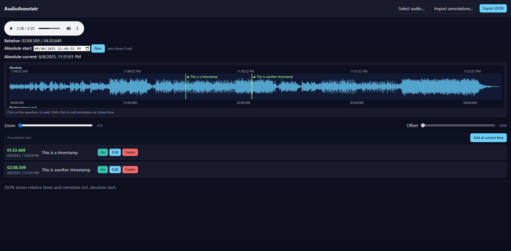

## AudioAnnotatr

Browser-based audio waveform viewer and timestamp annotator. Load any audio file, scrub the waveform, drop annotations at precise moments, and export/import clean JSON. Everything runs fully in your browser — no sign‑in, no uploads

Try it here: https://andjar.github.io/AudioAnnotatr/



### Why this is useful
- **Fast timestamping**: Mark key moments in interviews, podcasts, lectures, user tests, radio logs, or game audio without switching tools.
- **Absolute and relative time**: Capture the wall‑clock time of events with an absolute axis, or work purely in relative time.
- **Portable JSON**: Export annotations to a minimal schema that’s easy to ingest in scripts, spreadsheets, or ML pipelines.
- **Private by design**: Audio never leaves your machine; files are opened locally via the browser.
- **Zero setup**: Static site — just open `index.html`.

### Features
- **Waveform view** with zoom and horizontal panning
- **Click to seek**, **Shift+Click to add annotation** at the clicked time
- Add at the current playhead using the input and the “Add at current time” button
- **Go / Edit / Delete** actions per annotation
- Optional **absolute start** time; shows an “Absolute” axis and per‑annotation absolute timestamps
- **Import** existing JSON and **Export** to JSON at any time

## Quick start

Pick one of the options below:

- **Just open the file**: Double‑click `index.html` in your file explorer to run it in your default browser.
- **Run a tiny local server** (recommended for consistent browser behavior):
  - Python 3: `python -m http.server 8000` then open `http://localhost:8000/` and navigate to `index.html`.
  - Node.js: `npx --yes serve .` then open the shown local URL.

## Using the app
1. Click “Select audio…” and choose an audio file (`.mp3`, `.wav`, etc.).
2. Optional: set an absolute start time using the input or the “Now” button to anchor events to real time.
3. Add annotations:
   - Shift+Click on the waveform at the desired moment, or
   - Type text into the field and press “Add at current time”.
4. Use the zoom and offset sliders to focus on regions of interest.
5. Manage annotations in the list (Go / Edit / Delete).
6. Click “Export JSON” to download your annotations.
7. Later, use “Import annotations…” to continue where you left off.

### Mouse and controls
- **Click** waveform: seek and play from that point
- **Shift+Click** waveform: add annotation at clicked time
- **Zoom** slider: zoom in/out of the timeline
- **Offset** slider: pan horizontally when zoomed in

## JSON format

Exports follow a compact schema designed in `app.js`:

```json
{
  "schema": "audio-annotatr/v1",
  "absoluteStart": "2025-08-08T09:30:15.000Z" ,
  "audioFileName": "example.wav",
  "annotations": [
    { "t": 12.345, "label": "Intro starts", "meta": {} },
    { "t": 93.469, "label": "Key insight", "meta": {} }
  ]
}
```

- **t**: time in seconds from the start of the loaded audio (relative time)
- **label**: free‑text description
- **meta**: reserved for future use; currently an empty object
- **absoluteStart**: optional ISO string. When present, the app shows an absolute time axis and resolves each annotation’s absolute timestamp as `absoluteStart + t`.

## Project layout

- `index.html` — UI structure and controls
- `styles.css` — visual theme and layout
- `app.js` — waveform rendering, interactions, and JSON import/export
- `screenshot.png` — example screenshot used above

## Notes
- All processing is client‑side via the Web Audio API and Canvas.
- Works offline in modern desktop browsers.
- No build step, dependencies, or server required.


